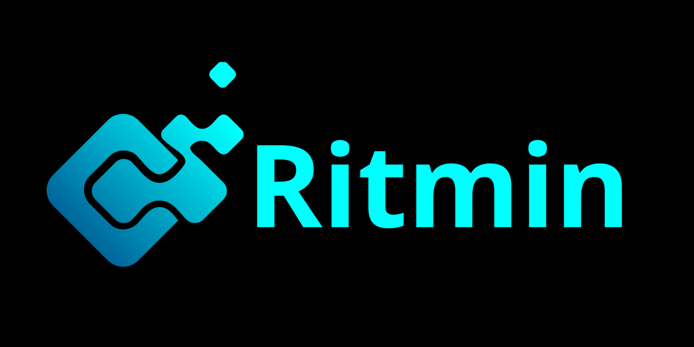

## Ritmin Framework
Ritmin is a comprehensive framework designed to simplify web application development by offering a robust set of reusable tools and components. Ritmin stands out for its flexibility and ease of use, making it an ideal choice for developers seeking effective and innovative solutions for building their applications.

 Note: Ritmin is a beta framework and is still under development. Features and components may be subject to continuous changes and improvements. 

 Note: There's a [document](README-ar.md) in Arabic if you'd like to take a look at it. 
## Overview
Ritmin provides a variety of tools and components that streamline the management and configuration of different elements in your web applications. The framework is designed to be flexible and customizable, allowing developers to adapt it to meet the specific needs of their projects.

## Key Features
 **Customizable Components:** Ritmin offers flexible components that can be easily customized to fit the requirements of your application.
 **Interaction Support:** The framework enhances user experience with tools that enable smooth and efficient interactions.
## Installing the Framework
To install the Ritmin framework, use npm:
``` bash
npm install ritmin
```
## Documentation
For more information on how to use the Ritmin framework and its libraries, please refer to the [official documentation](https://ritmin.gitbook.io/ritmin-docs/).

## Contribution
If you are interested in contributing to the development of the Ritmin framework or improving its components, please check the [contribution guidelines](CONTRIBUTING.md) and open pull requests on GitHub.

Note: There's a [contribution document](CONTRIBUTING-ar.md) in Arabic if you'd like to take a look at it.

## Acknowledgements
We would like to thank the following organizations and individuals for their support:

GitBook: Providing excellent documentation tools that help us deliver high-quality documentation for Ritmin.


## License
The Ritmin framework is licensed under the [MIT](LICENSE.txt) License.
## Support
For any inquiries or support, you can contact us via email or open a ticket on GitHub.

We hope you have an enjoyable experience with the Ritmin framework! We aim to provide tools and libraries that are useful for your projects.

